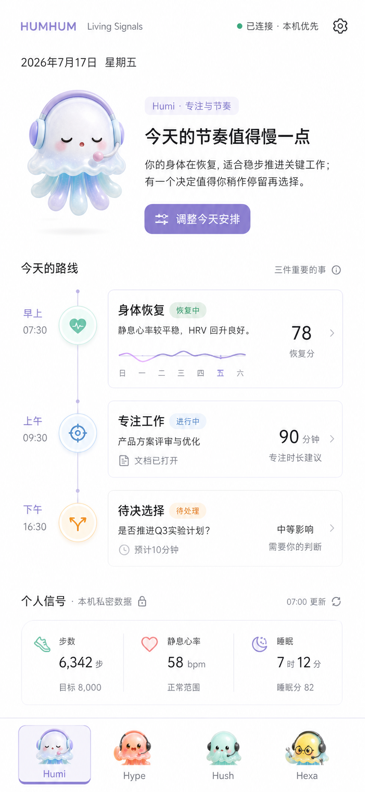

# HUMHUM Android Living Signals Design

## Goal

Turn the Android client from a technical remote-control panel into a calm mobile
companion that explains the user's day. The first production slice must:

- match the selected Living Signals visual direction;
- keep Humi, Hype, Hush, and Hexa visible and meaningfully distinct;
- move pairing diagnostics and reliability controls out of primary content;
- read explicitly authorized health summaries from the phone;
- send those summaries over the existing encrypted paired-device channel; and
- make the Mac-side Hush store the durable source of truth.

The phone is a sensor and interaction surface. It is not HUMHUM's long-term
personal data warehouse.

## Selected Visual Target



The target is a `390 x 844` portrait Android layout. It borrows the supplied
reference video's editorial hierarchy, but retains HUMHUM's own mascots, role
model, local-first behavior, and balanced lavender, coral, mint, yellow, and sky
blue palette.

The implementation should preserve the target's hierarchy, not reproduce every
generated pixel literally. In particular:

- Humi is present but does not consume the entire first viewport.
- The interpreted headline comes before metrics.
- The day route combines wellbeing, focused work, and one pending decision.
- Health is a compact supporting signal, not a fitness dashboard.
- The four role destinations remain fixed at the bottom.
- Settings is reached through the familiar gear icon.

## Product Structure

### First Run

The unpaired experience remains a focused camera-first flow:

1. A short Humi welcome.
2. One primary action: `扫描电脑配对二维码`.
3. One secondary recovery action: `手动配对`.

Scanning a current QR begins pairing immediately. URL, code, certificate
fingerprint, and device name stay hidden unless manual recovery is opened.

### Humi: Today

Humi is the default connected destination.

The first viewport contains:

- current date and a quiet encrypted-connection state;
- Humi's interpreted headline for today;
- one primary action, `调整今天安排`;
- a three-checkpoint day route:
  - body recovery;
  - focused work;
  - a pending decision;
- a compact personal-signals summary for steps, resting heart rate, and sleep.

Humi may combine authorized health summaries with existing Agent session
summaries, but must label unavailable or stale data honestly. It must never
invent a health conclusion from missing records.

### Hype: Knowledge

Hype shows interpreted mobile-safe knowledge:

- current working direction;
- frequently used skills or workflows;
- one suggested memory or knowledge gap.

Raw local paths, config files, and full memory documents remain on the Mac.
Until the desktop exposes a scoped interpreted summary, Hype keeps its current
honest unavailable state.

### Hush: Sources

Hush becomes the control point for personal signals and relationships. It has
two top-level sections:

- `重要消息`: the existing read-only relationship and message summary;
- `数据来源`: Health Connect, phone step counter fallback, and future structured
  sources.

Each source row shows availability, granted data types, last successful sync,
and a single manage action. Health permissions are never requested on app
launch or merely by opening Hush. The user must select a source and enable it.

### Hexa: Agents

Hexa retains real session viewing, recent conversation disclosure, approvals,
follow-up messages, background Agent monitoring, and remote actions.

The top of Hexa shows an interpreted status summary. Technical reliability
controls move to Settings. Session details remain below the summary and keep
their current scope and privacy gates.

### Settings

Settings is a dedicated destination opened from the gear icon. It is not a
fifth bottom tab.

Grouped rows:

- `这台 Mac`: computer name, encrypted route state, reconnect, disconnect;
- `数据与权限`: Health Connect, phone activity permission, background reads;
- `后台运行`: Agent monitoring, battery optimization, Xiaomi autostart;
- `隐私`: what is stored on the Mac, delete imported health summaries, revoke
  source access;
- `关于`: version and diagnostics disclosure.

Raw URL, TLS fingerprint, relay identifiers, tokens, and debug counters appear
only inside an explicit advanced diagnostics disclosure.

## Visual System

The Android app keeps the existing role colors while reducing decorative
surfaces:

| Role | Accent | Soft support |
| --- | --- | --- |
| Humi | lavender and ice blue | `#F1EEFF` |
| Hype | coral and peach | `#FFF0E9` |
| Hush | mint | `#EAF8F4` |
| Hexa | warm yellow and sky blue | `#FFF7DE` |

Shared rules:

- warm white base canvas;
- functional Chinese sans-serif typography;
- 14-16sp body text;
- compact headings inside phone surfaces;
- zero negative letter spacing;
- no nested cards;
- card radius no larger than 8dp;
- spacing and fine dividers before borders or elevation;
- familiar icons for settings, refresh, back, privacy, and navigation;
- mascot images are real raster assets and remain decorative for accessibility;
- all tap targets are at least 48dp;
- role selection uses shape, label weight, and color, not color alone.

The implementation uses Jetpack Compose for the screen shell and navigation.
Existing Java networking, TLS pinning, pairing, relay, encrypted snapshot, and
device-care classes remain behind small Kotlin-facing adapters. This limits the
rewrite to presentation and state coordination rather than changing the proven
security boundary.

## Health Data Boundary

### Supported First Slice

The first slice is read-only and disabled by default:

- daily step total;
- latest trusted resting-heart-rate record for the day;
- previous night's total sleep duration.

Health Connect is the preferred source. Cumulative steps use aggregation rather
than summing raw records. On devices where Health Connect is unavailable, the
Android step-counter sensor may provide a clearly labeled phone-only step
fallback. Heart rate and sleep remain unavailable rather than estimated.

Health Connect requires compatible Android/Google Play support. Chinese Xiaomi
devices without that support must receive a useful availability explanation,
not a broken permission button.

References:

- [Health Connect setup](https://developer.android.com/health-and-fitness/health-connect/get-started)
- [Reading and background access](https://developer.android.com/health-and-fitness/health-connect/read-data)
- [Android step counter](https://developer.android.com/develop/sensors-and-location/sensors/sensors_motion)

### Permission Rules

- No health permission is requested during pairing.
- The user enables steps, resting heart rate, and sleep individually.
- HUMHUM requests only the selected read permissions.
- Background health access has a separate toggle and rationale.
- Permission state is checked before every read because Android may revoke it.
- Revoking a source stops future reads and offers a separate Mac-data deletion
  action; it does not silently delete history.
- No write permission to Health Connect is requested.

### Collection Schedule

When enabled:

- refresh when the app enters the foreground;
- enqueue a bounded WorkManager refresh every six hours only after background
  read access is granted;
- retry transient failures with WorkManager backoff;
- do not run a continuous health foreground service;
- show the actual last successful read and sync times.

Xiaomi battery restrictions may delay periodic work. The UI must say
`后台同步可能被系统延迟` when relevant instead of claiming real-time monitoring.

## Structured Signal Model

Android emits bounded daily summaries:

```json
{
  "source_id": "health-connect:steps:2026-07-17",
  "kind": "health.steps.daily",
  "started_at": "2026-07-17T00:00:00+08:00",
  "ended_at": "2026-07-18T00:00:00+08:00",
  "value": 6342,
  "unit": "count",
  "source": "health_connect",
  "captured_at": "2026-07-17T19:30:00+08:00",
  "quality": "trusted"
}
```

The first slice sends daily aggregates only. It does not upload continuous
heart-rate samples, sleep-stage timelines, exercise routes, location, medical
records, reproductive-health data, or free-form Health Connect metadata.

Each upload is:

- limited to 31 summaries and 64 KiB;
- authenticated as the paired device;
- encrypted by the existing direct or Anywhere transport;
- idempotent by `(device_id, source_id)`;
- rejected when timestamps, kinds, units, or numeric bounds are invalid.

## Mac-Side Hush Vault

Hush receives structured signals through a dedicated authenticated mobile
endpoint and the equivalent encrypted relay action. Message inbox records are
not overloaded with health data.

Durable data lives under:

```text
~/.humhum/hush/structured-signals.sqlite3
```

The database contains:

- normalized source ID, device ID, kind, time range, unit, and capture time;
- an encrypted payload column for the value and source detail;
- a per-row nonce;
- created and updated timestamps.

The encryption key is generated locally, stored in an owner-only HUMHUM key
file, and never sent to the phone or relay. SQLite uniqueness constraints make
retries safe. A bounded retention and deletion API supports later source
policies without schema replacement.

The existing `hush-inbox.json` remains the message store during this slice.
Future structured sources use the vault rather than creating unrelated JSON
files for every connector.

## Data Flow

```text
Health Connect / Step Sensor
          |
          v
Android source adapter
          |
          v
Daily summary + permission provenance
          |
          v
Existing paired-device encryption
     direct or relay
          |
          v
Desktop mobile bridge validation
          |
          v
Hush structured signal vault
          |
          +--> Hush source status
          |
          +--> Humi interpreted daily view
```

The relay only sees opaque encrypted envelopes, channel identifiers, timestamps,
and sequence metadata. It does not receive readable health values.

## Error And Empty States

- Health Connect missing: explain compatibility and offer phone-step fallback
  when a step sensor exists.
- Permission denied: keep the source off and show `未授权`; do not repeatedly
  reopen Android permission UI.
- Background permission missing: foreground refresh still works.
- Mac offline: retain an encrypted, bounded seven-day outbound queue and retry
  after connectivity returns.
- Stale signal: show its capture time and avoid current-day conclusions.
- Partial data: interpret only available fields and label missing metrics.
- Revoked paired device: stop sync, clear transport credentials, preserve local
  permission state until the user explicitly disconnects the health source.

## Implementation Boundaries

This design changes the Android presentation architecture and adds one vertical
health-data path. It does not:

- replace existing mobile pairing or relay cryptography;
- request contacts, SMS, accessibility, location, or notification-listener
  access;
- ingest Xiaomi Health cloud data, whose public SDK access is partner-limited;
- make medical recommendations or diagnoses;
- turn Hush into a cloud service;
- expose raw health data to Agent prompts automatically.

Agent interpretation of health data requires a later, explicit user-controlled
policy. The first slice provides deterministic summaries only.

## Verification

### Android

- JVM tests for permission state, source availability, aggregation mapping,
  queue bounds, deduplication, and route selection.
- Compose UI tests at `390 x 844` for Humi, Hush sources, Hexa, Settings,
  unpaired, denied, unavailable, loading, and stale states.
- Screenshot comparison against the selected Living Signals target.
- Manifest inspection confirms only read health permissions and the activity
  recognition fallback permission.
- Release APK install, cold launch, QR pairing, 5G relay refresh, and permission
  revocation are exercised.

### Desktop

- Rust tests for validation, idempotent inserts, encrypted persistence,
  source/device isolation, deletion, payload limits, and relay parity.
- Existing Hush inbox and Mobile Bridge tests remain green.
- The database is confirmed owner-only and contains no plaintext health value.

### Physical Xiaomi Acceptance

- Health Connect availability is reported accurately.
- Phone-step fallback works when the hardware sensor exists.
- Denied permissions do not create retry loops.
- Periodic work survives app process recreation when the OS permits it.
- UI remains usable with larger font scaling and gesture navigation.

