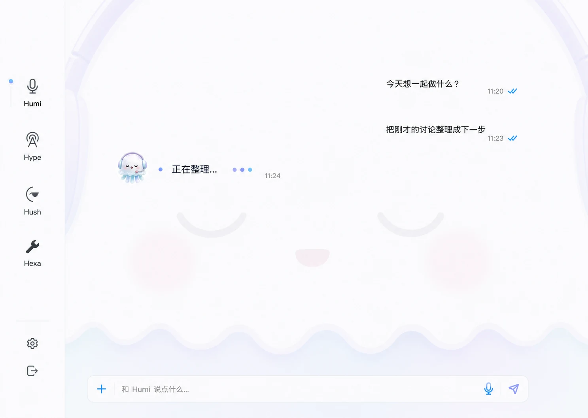
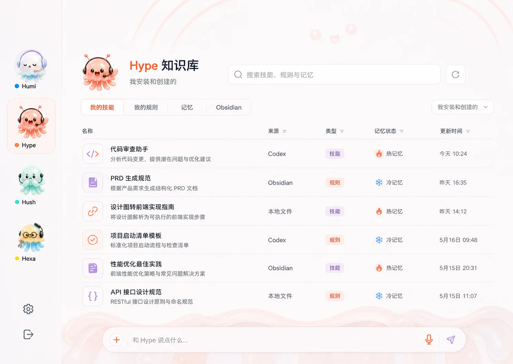
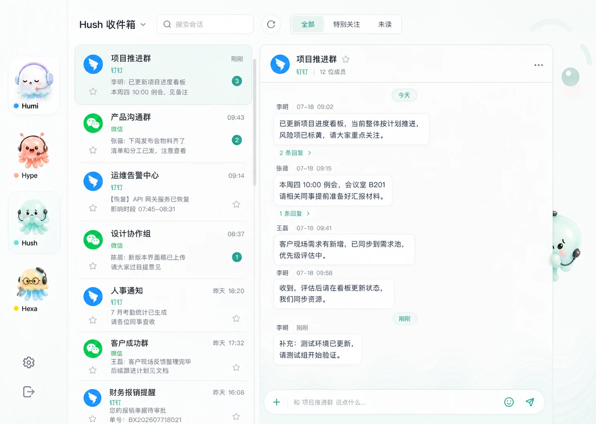
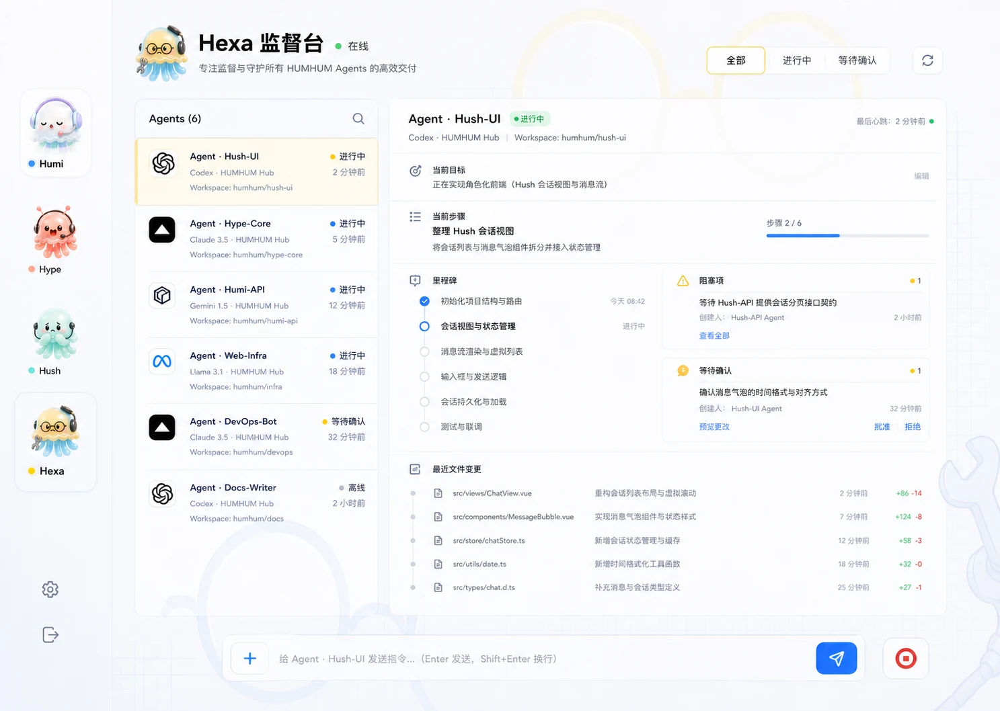
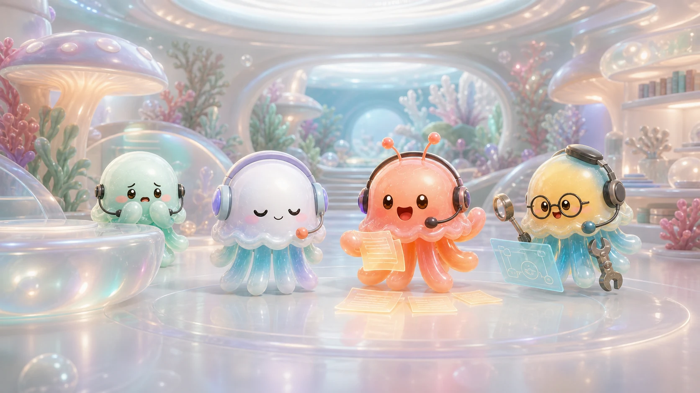
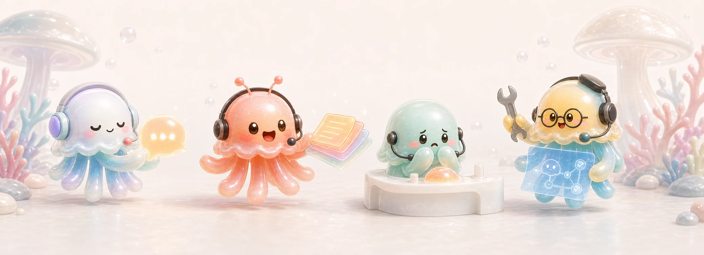

# HUMHUM Hub Character Rooms Design

## Status

Approved on 2026-07-18.

Design baseline: `origin/main` at `a362644`.

The approved direction is **four independent character rooms inside one shared
Hub shell**. Each module keeps its existing operational purpose and data, while
its mascot becomes an environmental presence rather than a decorative wallpaper.

## Goal

Make Humi, Hype, Hush, and Hexa immediately recognizable from the first viewport
without weakening the information hierarchy of chat, knowledge, messages, or
Agent supervision.

The redesign must:

- preserve the current local-first workflows and data sources;
- make information the first visual layer and the mascot the second;
- give every module a distinct color and behavior;
- use ImageGen-created raster artwork for visible character imagery;
- avoid adding a marketing page, feature inventory, or decorative dashboard;
- remain usable in the current `900 x 700` resizable Tauri Hub window.

## Approved Visual References

The mockups are design targets, not runtime screenshots. Runtime backgrounds must
be generated as clean, text-free assets derived from them.

### Humi chat room

### Hype knowledge room

### Hush quiet inbox

### Hexa supervisor room

### Shared family artwork

## Core Design Rules

### 1. Information first

Text, controls, state, and list structure carry the strongest contrast. Mascot
art stays around 10-18% contrast in content areas and must never sit directly
under important body text.

### 2. Mascots are spatial grammar, not enlarged wallpaper

Each room abstracts its mascot through recognizable features:

- Humi: headset arcs, closed crescent eyes, blush, tiny mouth, soft scalloped
  lower edge;
- Hype: antenna arcs, excited eye glints, open smile, tentacle rhythms that guide
  knowledge rows;
- Hush: worried eyes, protective front tentacles, and a small full Hush peeking
  from the conversation edge;
- Hexa: round glasses, wrench/tool-arm silhouette, and a blueprint grid aligned
  to operational columns.

One small fully rendered mascot may appear near the module title or current
activity. A large literal character render must not be used as the page
wallpaper.

### 3. One shared shell, four independent rooms

The title bar, window controls, navigation rail, base typography, control sizes,
and spacing stay consistent. The active room changes its accent tokens,
background artwork, and mascot behavior.

### 4. Keep the operational product dense and calm

Use spacing, typography, alignment, and row separators before surfaces, borders,
or shadows. Do not turn every message, knowledge item, or status into a separate
card. Cards are reserved for genuinely bounded objects such as a modal,
confirmation request, or standalone selected item.

## Shared Hub Shell

### Window

- Keep the current borderless, transparent, resizable Tauri window.
- Design primarily for `900 x 700`.
- Support widths down to `760px` without horizontal page scrolling.
- At narrower widths, collapse secondary metadata before reducing primary text.
- Keep the current 52px draggable title bar and window controls.

### Navigation rail

- Keep the 72px rail so current content widths remain stable.
- Replace `H`, `Y`, `S`, and `X` letter tiles with real mascot portraits.
- Each item contains portrait, name, and a small theme-color state dot.
- Active and hover surfaces use an 8px maximum radius and no large shadow.
- Do not crop the family reference sheet at runtime. Use dedicated portrait
  assets derived from the approved mascot sources.

### Typography and controls

- Body text: 13-15px at the real `900 x 700` window size.
- Module title: 22-26px, never hero scale.
- Metadata: 10-12px with sufficient contrast.
- Use the existing Lucide icon library for search, refresh, voice, send, star,
  stop, filters, and window actions.
- Familiar icon-only controls include tooltips and accessible labels.
- Text controls are used only for clear commands or segmented filter choices.
- Maximum visible radius is 8px except circular avatar/state dots.

### Background assets

- Generate one text-free raster background for each module with ImageGen.
- Target source size: `1536 x 1024` or larger in the same aspect family.
- Store optimized runtime assets under `public/mascots/hub-backgrounds/`.
- Prefer WebP when visual QA confirms no visible transparency or banding loss.
- Keep each background under approximately 1.2MB after optimization.
- Do not use the approved UI mockup screenshots as runtime backgrounds.
- Background positioning must be module-specific and responsive.

## Humi Room

### Role

Direct conversation and voice interaction with Humi.

### Palette

- pearl white base;
- pale aqua;
- restrained lilac;
- small coral/pink state accents;
- neutral charcoal text.

### Composition

- The abstract Humi face fills the room at very low contrast.
- Headset arcs frame the top and side edges.
- Closed eyes and blush occupy unused negative space.
- The scalloped jellyfish fringe can anchor the lower background.
- A small rendered Humi sits beside the active assistant response or composer.

### Information layout

- Preserve a clean vertical conversation transcript.
- Avoid oversized speech bubbles; use grouped speaker rows and spacing.
- Current response may use one subtle tinted surface.
- Keep the composer anchored to the bottom with attachment, voice, and send
  actions.
- The mascot background must not reduce transcript contrast or obscure selection,
  streaming, error, or permission states.

## Hype Room

### Role

Search and inspect the user's own skills, rules, memories, local files, and
Obsidian index.

### Palette

- orange-red for energy and active actions;
- purple for type, metadata, and organization;
- pearl white base;
- neutral charcoal text.

### Composition

- Antennae frame the upper edge.
- Excited eyes and a tiny open smile appear only in unused background zones.
- Tentacle or shelf rhythms subtly align with knowledge rows.
- A small rendered Hype marks refresh or indexing activity.

### Information layout

- Make search the dominant action.
- Keep refresh as a compact icon button.
- Default scope emphasizes `我安装和创建的`.
- Primary segmented scopes are `我的技能`, `我的规则`, `记忆`, and `Obsidian`.
- Use a dense grouped list or table, not a card grid.
- Each row can expose display name, one-line description, source, type,
  hot/cold memory state, and update time.
- Marketplace/cache inventory must not overwhelm personal skills by default.

## Hush Room

### Role

A quiet inbox for conversation-level reading, special attention, and recent
message review.

### Palette

- pale mint green as the room color;
- warm orange for attention and priority;
- restrained blue for `钉钉` sources;
- restrained WeChat green for WeChat sources;
- neutral charcoal text.

### Composition

- Abstract worried eyes and protective tentacles stay low contrast.
- A small full Hush peeks from behind the right edge of the selected conversation
  pane. It should look observant, not alarming.
- The peeking asset must not cover the scrollbar, sender names, timestamps, menu,
  or composer.

### Information layout

- Keep the two-pane inbox.
- Sort conversations by latest message time descending.
- Left rows show source, conversation name, grouped preview, unread count, and a
  star control for `特别关注`.
- Primary filters are `全部`, `特别关注`, and `未读`.
- The right pane groups chronological messages into coherent conversation
  clusters. Do not render every sender message as a standalone floating card.
- Keep sender name and timestamp subordinate to message content.
- Use only the product name `钉钉` in code comments, user-facing strings, and
  labels where product naming is required.

## Hexa Room

### Role

Supervise watched Agents, their goals, current steps, milestones, blockers,
confirmations, heartbeat, and evidence.

### Palette

- yellow for attention, decisions, and waiting confirmation;
- sky blue for progress, structure, and healthy execution;
- pearl white base;
- neutral charcoal text.

### Composition

- Round glasses frame unused background areas.
- A tool arm or wrench silhouette can occupy an outer edge.
- A subtle blueprint grid aligns with columns and timelines.
- A small rendered Hexa marks live supervision.

### Information layout

- Use a focused two-column workbench.
- Left: watched Agents sorted by urgency and heartbeat recency.
- Right: selected Agent goal, current step, milestones, blockers,
  confirmations, and recent file changes.
- Keep intervention input at the bottom with send and stop icon actions.
- Avoid metric-card dashboards; summary numbers belong in compact rows or badges.
- Mobile pairing and QR remain available but are secondary and should not occupy
  the default supervision frame.

## Shared Family Artwork

The two approved group images support the product without creating another
landing page:

- `family-workshop-stage.webp`: empty/loading/onboarding states where no module
  data is available;
- `family-handoff-banner.webp`: bounded transition or contextual empty state where
  cross-module handoff is relevant.

Do not place both on the same screen. Do not show them continuously behind dense
operational content.

## Motion

- Keep ambient movement subtle: slow highlight drift, one small blink, or a
  6-10s breathing cycle.
- Module switching can crossfade the room background in 160-220ms.
- Hush may move a few pixels farther into view when a special-attention
  conversation is selected.
- Hype may pulse the antenna state once after a completed refresh.
- Hexa may rotate or nudge a tool cue only during an active state transition.
- Respect `prefers-reduced-motion` and disable all nonessential movement.
- Motion must never resize the layout or move readable content.

## Accessibility

- Maintain WCAG AA contrast for primary text and controls.
- Decorative background images use empty alt text and are hidden from assistive
  technology.
- Portrait navigation buttons keep explicit accessible module names.
- Active, unread, hot/cold, waiting, and blocked states must not rely on color
  alone.
- Keyboard focus remains visible in every theme.
- Test 200% zoom and the minimum supported window width.

## Implementation Boundaries

This redesign is frontend-only unless a missing state is discovered during
implementation. It must not:

- change knowledge indexing, Hush message storage, or Hexa supervision data;
- write to Obsidian or any message source;
- add cloud services or external APIs;
- rename existing Tauri commands or persisted data;
- duplicate data loading in presentation components.

Likely implementation touchpoints:

- `src/components/Hub/HubLayout.tsx`
- `src/components/Hub/HumiModule.tsx`
- `src/components/Hub/KnowledgeModule.tsx`
- `src/components/Hub/HushModule.tsx`
- `src/components/Hub/HexaModule.tsx`
- focused room-specific components under `src/components/Hub/`
- `src/styles/global.css` or a new Hub-specific stylesheet imported once
- `public/mascots/hub-backgrounds/`

## Verification

### Functional

- Existing module actions remain callable and keep their current loading, empty,
  success, and error behavior.
- Hype search and refresh remain visible and usable.
- Hush conversation ordering, source distinction, grouping, and special attention
  remain intact.
- Hexa Agent selection, supervision details, confirmation actions, intervention,
  and stop actions remain intact.
- Humi streaming, voice, send, and permission/error states remain intact.

### Visual

- Capture `900 x 700`, `1100 x 760`, and the minimum supported width for every
  module.
- Compare each implementation screenshot beside its approved mockup.
- Verify no text overlaps mascot features.
- Verify no image stretching, blank asset, broken crop, or abrupt background seam.
- Verify all four rooms are visually distinct while the shell remains stable.
- Verify `钉钉` blue and WeChat green remain visible inside the pale mint Hush
  theme.

### Build

- Run `npm run build`.
- Run focused frontend tests for changed Hub components.
- Run `cargo check` only if Rust or generated Tauri command surfaces are touched.

## Known Risks

- The approved mockups were generated at `1440 x 1024`, while the real Hub starts
  at `900 x 700`; implementation must preserve hierarchy rather than blindly
  scaling the mockups.
- Character artwork can overpower dense data. Background contrast and positioning
  require per-module tuning at all tested widths.
- High-resolution images can inflate the desktop bundle. Runtime assets need
  optimization and lazy loading.
- Existing inline styles in Hexa and Hush can fight shared theme tokens. Migrate
  only the styles required for this redesign and avoid unrelated refactors.
